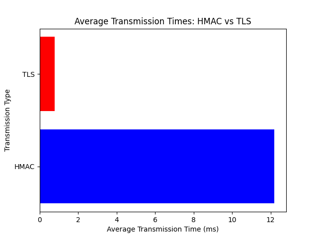
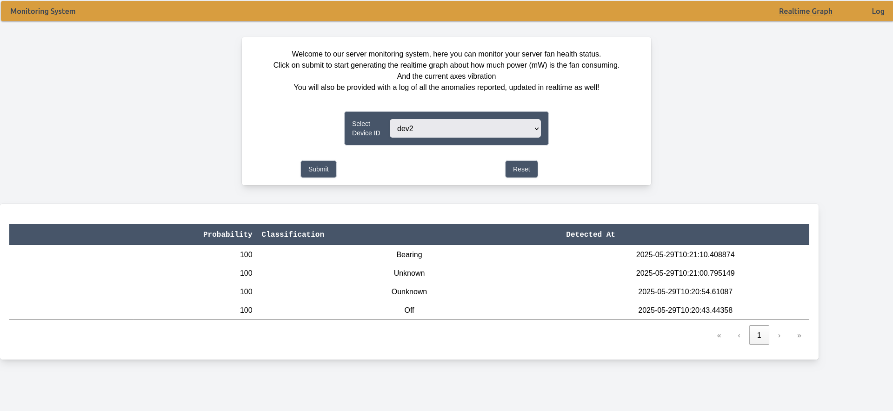

# FanGuard - Analytics
Edge-AI predictive-maintenance node for server-rack fans

---

# Table of Contents

TODO

---

## 👨‍💻 **Team:**  
- Massimiliano Vitale: [Linkedin](https://www.linkedin.com/in/massimiliano-vitale/)
- Luca Cornici: [Linkedin](https://www.linkedin.com/in/luca-cornici-a31a822b9/)  
- Angelo Pio Pompeo: [Linkedin](https://it.linkedin.com/in/angelo-pio-pompeo-6a2960225)

📹 **Project presentation video:** [FanGuard-Analytics Presentation Video](https://youtu.be/Nzetp7tr6uA)

📑 **Project presentation deck:** [FanGuard-Analytics Presentation Deck](https://www.canva.com/design/DAGiGgqm3vg/dWG1Gl8j_IxVZVRmSFhmMA/view?utm_content=DAGiGgqm3vg&utm_campaign=designshare&utm_medium=link2&utm_source=uniquelinks&utlId=ha00e9f673b) 

---

## Introduction
Server-rack fans are critical to datacentre uptime, but mechanical wear gradually introduces excessive vibration and current spikes that precede outright failure. **FanGuard** sits directly on the fan power rail, sampling both vibration (MPU6050, 3-axis) and power draw (INA219). Specifically, this IoT project is developed for **Sapienza University’s DIAG** structure, focusing on maintaining **high availability** and **fault tolerance** for the laboratory servers.  
A lightweight anomaly-detection model runs in real-time on an **ESP32** under **FreeRTOS**, pushing alerts to the facility’s MQTT broker and main control dashboard.


---

## Why we chose RMS?


- **Overall Vibration Level**: RMS provides a single, scalar value that represents the overall energy or intensity of the vibration signal over a given time window. This makes it easy to track changes in the general vibration level of the fan.   

- **Sensitivity to Changes**: A significant increase in the RMS value often indicates a change in the fan's operational state, which could be cause by anomalies.

- **Correlation with Energy**: RMS is proportional to the energy of the vibration. Increased vibration energy is a key indicator of potential problems in rotating machinery.   
- **Simplicity and Low Computational Cost**: Calculating RMS is straightforward and computationally inexpensive, reducing the impact on system responsiveness and energy consumption.


#### References:
    - https://dynamox.net/en/blog/the-peak-peak-to-peak-and-rms-values-in-vibration-analysis
    - https://doi.org/10.1016/j.dib.2024.110866
    - https://www.researchgate.net/figure/Anomaly-detection-velocity-RMS-and-acceleration-peak-to-peak-in-a-form-of-a-box-plots_fig7_349233935 

---

## Components & Wiring
The hardware stack is deliberately minimal: a single **ESP32** sits at the centre, sharing an I²C bus with two peripheral sensors—the tri-axis accelerometer for vibration analysis and the INA219 for power analytics—while tapping straight into the 5 V fan rail. The diagram below shows the exact pin-to-pin wiring, colour-coded for clarity (power in red, I²C in blue/orange, ground in black).


---

## How we detect anomalies

This project implements an intelligent IoT system designed to **detect anomalies in a fan's operation**, ensuring efficient performance and preventing critical failures. By leveraging two distinct sensor types, our solution offers a comprehensive and robust monitoring approach.

### MPU6500: Catching Physical & Catastrophic Anomalies

The **MPU6500 (accelerometer)** is tasked with identifying **physical, fast, and potentially catastrophic anomalies**. During an initial setup phase, the system establishes a **baseline** of normal fan vibration and movement. If the MPU6500 detects acceleration exceeding a predetermined threshold from this baseline, it immediately flags an anomaly.

### INA219: Monitoring Power-Related & Developing Anomalies

The **INA219 (power monitor)** continuously analyzes the **fan's power consumption**. Every **two minutes**, the system processes this data to identify deviations from normal power draw. This approach is ideal for detecting **power-related issues that tend to develop over time**, such as:

* **Bearing Degradation**: As bearings wear out, the fan might draw more power due to increased friction. This indicates a gradual decline in efficiency.
* **Power Fluctuations**: Inconsistent power usage can signal electrical problems or an intermittently struggling motor.
* **Shutdown**: A complete loss of power consumption is detected instantly, indicating the fan has stopped running entirely.

---

## Why Our Solution is Good: Comprehensive & Proactive Monitoring

### Comprehensive Anomaly Coverage
By combining the MPU6500 and INA219, our system achieves **comprehensive anomaly detection**. The MPU6500 handles immediate physical threats, while the INA219 monitors for developing power-related issues. This dual approach ensures that few, if any, critical fan problems go unnoticed.

### Intelligent Risk-Priority Analysis
We've implemented a clear **risk-priority analysis** for power-related anomalies:

1.  **Fan OFF (Highest Risk)**: This is the most critical event as it implies a complete loss of cooling, demanding immediate attention.
2.  **Current Fluctuations (Medium Risk)**: While not immediately catastrophic, these indicate reduced cooling efficiency and potential underlying electrical problems that need to be addressed.
3.  **Bearing Degradation (Lowest Risk)**: This is a gradual issue leading to performance decline, allowing more time for scheduled maintenance.

### Optimal Detection Timing & Built-in Safety Margin
Our choice of a **2-minute check interval for the INA219** is carefully considered. Among power anomalies, a **fan shutdown is the most severe**. This 2-minute interval ensures that we detect a complete fan stoppage very quickly.

Crucially, this design also incorporates a robust safety measure against potential overheating. Given a **5-minute critical temperature constraint** for the system the fan is cooling, our worst-case detection delay (2 minutes) leaves a significant **3-minute safety margin**. This valuable time allows for:
* **Alert processing and transmission** to relevant personnel.
* **Human response time** for assessment.
* **Activation of emergency cooling** or other mitigation strategies.

This **proactive safety engineering practice** ensures that we don't just detect problems, but we detect them with enough lead time to prevent escalation into critical system failures.

---


## Sampling frequency

This system leverages two primary sensors: the MPU-6500 and the INA219, working in parallel to provide a comprehensive understanding of system behavior.

**1. MPU-6500 for High-Frequency Anomaly Detection (Motion and Vibration)**

* **Purpose:** We utilize the MPU-6500 with **motion interrupts** to detect anomalies related to **motion, vibration, and orientation changes**. This is crucial for identifying sudden mechanical issues, sudden impacts, or unusual movement patterns.
* **High Sampling Rate (1 kHz):** We sample the MPU-6500 at a high rate of **1 kilohertz (1000 samples per second)**.
    * **Reasoning:** This high sampling rate is specifically chosen to capture **high-frequency phenomena**. Many critical mechanical anomalies, such as subtle vibrations indicating bearing wear, imbalances in rotating components, or transient shocks, manifest as rapid changes in acceleration. A lower sampling rate would simply miss these fast-occurring events, making effective anomaly detection not reliabe.

**2. INA219 for Power-Related Anomaly Detection (Current and Voltage)**

* **Purpose:** The INA219 is employed to detect anomalies related to **electrical power consumption**. These anomalies often indicate changes in the operational state or efficiency of connected components.
* **Parallel Sampling (1 kHz):** Although the power-related anomalies it detects are generally not high in frequency, we sample the INA219 **in parallel with the MPU-6500 at the same 1 kHz rate**.
    * **Reasoning for parallel sampling:** While the *anomalies themselves* might be lower frequency, sampling at 1 kHz in parallel ensures **perfect time synchronization** between motion and power data. This synchronization is critical for:
        * **Correlating events:** We can precisely link a mechanical anomaly (detected by MPU-6500) with a change in power consumption (detected by INA219), this conjunction of data will be the input for neural netowrk used fo anomaly detection.
    * **Examples of detectable anomalies related to power (not high frequency):**
        * **Turning off the fan:** A sudden, significant drop in current draw and power consumption would indicate the fan has stopped operating.
        * **Constant fluctuations in power:** While not "high frequency" in the sense of vibrations, persistent, non-periodic variations in power consumption could indicate an unstable power supply, loose connections, or a malfunctioning electrical component.
        * **Traction on the motor that elevates power consumption:** An increase in the load or resistance on a motor (e.g., due to mechanical binding, increased friction) will lead to a noticeable and sustained elevation in power consumption. This anomaly is often characterized by a gradual or step-wise increase rather than a rapid spike.

**System Integration and Anomaly Detection:**

By combining the real-time, synchronized data from both sensors, our system gains a holistic view of the monitored environment. Anomaly detection algorithms combined with the building of a baseline and the set of a threshold for MPU650, are crucial to analyze these data streams to identify deviations from normal operating conditions. This multi-modal sensing approach significantly enhances the accuracy and reliability of our anomaly detection capabilities, allowing us to identify issues that might be missed by monitoring only motion or only power in isolation.

---
## General software schema


## Program phases

The program operates in distinct phases based on the device's boot and wakeup conditions:

**Phase 1: First Boot Initialization**
This phase occurs only once, during the very first power-up of the device.
* **Device ID Calculation**: A unique ID for the device is generated from its MAC address.
* **Sensor Initialization**: The INA219 power monitor is initialized, and the MPU6500 accelerometer is initialized.
* **Baseline Calibration**: A FreeRTOS task, `build_baseline_mpu6500`, is created to establish a baseline for motion detection. This task involves two sub-phases:
    * **Average Baseline Acceleration**: The system collects numerous accelerometer readings to determine the average acceleration values, including the gravity component.
    * **Maximum Deviation Measurement**: It then measures the maximum deviations from these established baselines over a series of samples.
* **Threshold Calculation**: Based on the observed maximum deviations, a motion detection threshold is calculated and adjusted with a safety multiplier. This threshold is then converted into units that the MPU6500 can use for its Wake-on-Motion interrupt.

**Phase 2: Wakeup from Deep Sleep for Periodic Check (INA Timer)**
This phase is triggered when the device wakes up from deep sleep due to a pre-set timer, indicating a periodic check for the INA219 sensor.
* **Wakeup Cause Recognition**: The program identifies that the wakeup reason was `ESP_SLEEP_WAKEUP_TIMER`.
* **High-Frequency Sampling**: A `high_freq_sampling` task is immediately created. This task orchestrates the collection of high-frequency data from both the INA219 (power consumption) and MPU6500 (motion) sensors.
    * It concurrently runs two sub-tasks: `task_flt_ina` to read filtered INA data and `task_avg_acc` to get RMS acceleration readings.
* **Feature Collection and Classification**: Once the sampling is complete, the collected data is compiled into a feature set by the `fill_features` function. This feature set is then fed into a machine learning classifier (`classify()`) to detect any anomalies in power consumption or motion patterns.
* **MQTT Communication (if anomaly)**: If the classifier identifies an anomaly (i.e., not a "normal" classification), the relevant data (classification, timestamp, probability) is sent via MQTT by calling `send_anomaly_mqtt`. This function in turn creates a `communication_task` to handle the actual MQTT communication.
* **Return to Deep Sleep**: Regardless of whether an anomaly was detected, the system re-enters deep sleep after completing the sampling and communication (if any).

**Phase 3: Wakeup from Deep Sleep due to MPU6500 Interrupt**
This phase is initiated when the MPU6500 detects significant motion while the device is in deep sleep, triggering an external interrupt.
* **Wakeup Cause Recognition**: The program recognizes that the wakeup reason was `ESP_SLEEP_WAKEUP_EXT0`, indicating an MPU6500 interrupt.
* **Motion Anomaly Flag**: The `motion_anomaly` flag is set to `true`.
* **High-Frequency Sampling**: Similar to the INA timer wakeup, a `high_freq_sampling` task is created. This task collects high-frequency data from both sensors for detailed analysis.
* **Feature Collection and Classification**: The collected sensor data is processed, and the classifier determines if the detected motion constitutes an actual anomaly.
* **MQTT Communication (if anomaly)**: If an anomaly is confirmed by the classifier, the data is sent via MQTT.
* **Return to Deep Sleep**: After processing the motion event, the system transitions back into deep sleep.


---

## Sensor Data Analysis

This section provides a graphical demonstration and intuitive understanding of how an IoT system can infer the state of a fan by utilizing both vibration and power consumption data.

### Bearing


- **Power Level**: ~230W (stable high power)
- **RMS Values**: X: ~0.03, Y: ~1.09, Z: ~0.05
- **Characteristics**: Stable operation with consistently high Y-axis vibration indicating bearing-related activity
- **Description**: Represents high traction conditions on a fan motor system, typically caused by bearing degradation, insufficient lubrication, or increased mechanical resistance. The elevated power consumption (~230W) indicates the motor is working harder to overcome bearing friction, while the stable vibration pattern suggests consistent but problematic bearing performance that requires maintenance attention.

### System Fluctuations


- **Power Level**: Variable (25-165W) with cyclical patterns
- **RMS Values**: X: ~0.06, Y: ~1.09, Z: ~0.05
- **Characteristics**: Highly variable power consumption indicating system instability or cyclical operation modes
- **Description**: Represents unstable power supply. This pattern could signal energy management systems or equipment struggling to maintain consistent operation.

### Normal Operation


- **Power Level**: ~140W (consistent moderate power)
- **RMS Values**: X: ~0.05, Y: ~1.09, Z: ~0.05
- **Characteristics**: Steady baseline operation with consistent power and vibration levels
- **Description**: Represents optimal steady-state operation under normal working conditions. This serves as the baseline reference for comparison with other operational states, indicating healthy fan performance with balanced load and minimal mechanical stress.

### Obstruction


- **Power Level**: ~200W (elevated but stable)
- **RMS Values**: X: 0.06-0.14 (variable), Y: ~1.09, Z: 0.06-0.13 (variable)
- **Characteristics**: Elevated and variable X/Z axis vibrations indicating mechanical obstruction or interference
- **Description**: Represents mechanical interference such as foreign objects in moving parts, misalignment, or partial blockages. The increased power consumption and erratic X/Z vibrations suggest the system is working harder to overcome resistance, potentially leading to accelerated wear if not addressed.

### System Off


- **Power Level**: 0W (no consumption)
- **RMS Values**: X: ~0.05, Y: ~1.09, Z: ~0.05 (baseline sensor noise)
- **Characteristics**: Complete power shutdown with only residual sensor noise remaining
- **Description**: Represents complete system shutdown.

### Analysis Summary

| Condition | Power (W) | RMS X | RMS Y | RMS Z | Key Indicators |
|-----------|-----------|-------|-------|-------|----------------|
| **Bearing Operation** | ~230 | ~0.03 | ~1.09 | ~0.05 | High stable power with consistent vibrations |
| **Fluctuations** | 25-165 | ~0.06 | ~1.09 | ~0.05 | Highly variable power with cyclical patterns |
| **Normal Operation** | ~140 | ~0.05 | ~1.09 | ~0.05 | Moderate stable power with balanced vibration |
| **Obstruction** | ~200 | 0.06-0.14 | ~1.09 | 0.06-0.13 | Elevated power with increased X/Z axis variability |
| **System Off** | 0 | ~0.05 | ~1.09 | ~0.05 | No power consumption |

---

## AI / Machine-Learning Pipeline
FanGuard combines motion and power analysis to detect anomalies in server-rack fans, running entirely on-device with no cloud dependency. By leveraging both vibration (MPU6500) and power consumption (INA219), the system achieves richer condition monitoring and fewer false positives. This hybrid approach allows for earlier detection of issues like bearing wear or airflow obstruction, even when vibrations are subtle.

We preprocess the raw sensor signals to compute RMS values for motion axes and average power, then classify patterns using a compact neural network trained in Edge Impulse and deployed on ESP32 with TensorFlow Lite Micro.

### 1. Data acquisition & labelling  
| Parameter           | Value                                                  |
| ------------------- | ------------------------------------------------------ |
| Sampling source     | ESP32 → MPU6500 (motion), INA219 (power)               |
| On-device pre-proc. | RMS (x/y/z) + averaged power (mW)                      |
| Labels              | `bearing`, `fluctuations`,`normal`,`obstruction`,`off` |
| Dataset size        | 470 samples → 80% train / 20% test                     |


> 📄 *Code reference*: [src/ml-model/dataset-builder.ino](src/ml-model/dataset_builder.ino)

### 2. Edge Impulse pipeline  
- **Input Block**: 4 Axes:`rms_x`, `rms_y`, `rms_z`, `pw` inputs.  Window size: 270ms, Stride: 100ms, Frequency: 50Hz
- **Classifier Block**: Fully-connected network for multi-class classification.  
- **Deployment**: export as a **Quantized (INT8)** model using the **EON™ Compiler**.  


### 3. Model Architecture & Training

The model accepts four input features—**RMS from X/Y/Z motion axes and power consumption**—and feeds them into a shallow, fully-connected neural network optimized for on-device inference.

**Network Structure:**

* **Input Layer:** 4 features (`rms_x`, `rms_y`, `rms_z`, `pw`)
* **Dense Layer 1:** 16 neurons
* **Dense Layer 2:** 8 neurons
* **Output Layer:** 5 classes (`bearing`, `fluctuations`, `normal`, `obstruction`, `off`)

**Training Configuration:**

* **Epochs:** 150
* **Batch Size:** 32
* **Optimizer:** Adam
* **Learning Rate:** 0.01
* **Class Balancing:** Enabled (auto-weighting)
* **Quantization:** INT8 for deployment on TensorFlow Lite Micro

### 4. Model performance & accuracy
The model achieves high classification accuracy and excellent separation between classes.


---

## Power consumption: measurements


## Power Consumption: analysis

To establish an upper bound for the system's lifetime, we'll simplify our energy consumption model. While the device's total energy usage is influenced by both periodic checks and anomaly detection initiated by MPU6500 interrupts, we'll only account for the energy consumed by periodic checks in this calculation.

### Power States
- **Initialization Phase**: 6 seconds at system startup
- **Deep Sleep**: 2-minute cycles with motion interrupt capability
- **Anomaly Detection**: 2-5 seconds depending on trigger type
- **WiFi Communication**: 2 seconds when anomalies are detected

### Wake-up Conditions
1. **Timer-based**: Every 2 minutes for routine monitoring
2. **Motion interrupt**: When MPU6500 threshold is exceeded

## Power Consumption Specifications

| Component/State | Power (mW) | Current (mA)* |
|-----------------|------------|---------------|
| Initialization | 130 | 35.1 |
| Anomaly Detection | 150 | 40.5 |
| WiFi/MQTT Communication | 400 | 108.1 |
| Deep Sleep | 0.6 | 0.16 |


## Battery Life Calculations
In case of **Battery**: 4000mAh Li-ion (3.7V)
#### Best Case (No Anomalies Detected)
- **Cycles per day**: 720 (every 2 minutes)
- **Energy per cycle**: 0.0147 mAh
- **Daily consumption**: 10.58 mAh
- **Battery life**: **273 days (9.1 months)**

### Best Case Scenario (No Anomalies)

| Component | Energy (mAh/day) | Percentage |
|-----------|------------------|------------|
| Deep Sleep | 9.60 | 90.8% |
| Anomaly Detection | 0.97 | 9.2% |
| **Total** | **10.57** | **100%** |
---

## Security Implications:

### Security Threats

Our system security can be threatened during the WiFi communication between the IoT device and the MQTT broker, here we list possible types of threat:

1. **Tampering**
    
    **Threat**: An attacker could modify the vibration data in transit, potentially causing:   
    
    - **False negatives**: Masking actual anomalies to prevent detection
    - **False positives**: Creating false alarms leading to unnecessary maintenance
    - **System disruption**: Corrupting data to cause processing errors

    **Impact**: Compromised data integrity leading to incorrect anomaly detection and potentially costly maintenance decisions.

2. **Spoofing**

    **Threat**: An attacker could impersonate legitimate IoT devices by:
   
   - Creating fake devices that send fabricated data
   - Hijacking device identities to inject malicious data
   
    **Impact**: data pollution.

4. **Replay Attacks**

    **Threat**: An attacker could capture valid data transmissions and replay them later:    
        
    - Resending old "normal" vibration data to hide developing anomalies
    - Replaying the same data repeatedly to mask actual readings
    - Flooding the system with replayed messages causing denial of service
   
    **Impact**: Outdated or irrelevant data being processed as current, leading to missed anomalies and ineffective monitoring.

### First Implementation: HMAC

In the first version of our system we choose to implement Hash-based Message Authentication Code (HMAC) in order to ensure message integrity and authentication. This method is used at the MQTT level where each message has this format: 

    
    +----------------------------------------------------------------------+
    | RMS_X | RMS_Y | RMS_Z | SESSION_ID | SQUENCE_NUM | TIME_STAMP | HMAC |
    +----------------------------------------------------------------------+
    
    
The HMAC is computed using:

    
    HMAC = Hash(SecretKey, Payload + Timestamp + SequenceNumber + SessionID)
    
**Key Components**:

- **Hashing function**: SHA256

- **Secret Key**: Shared between server and esp32
    
- **Timestamp**: Used to prevents replay attacks with old captured data

- **Sequence Number**: Monotonically increasing counter for each message from a device,

- **Session ID**: Unique identifier generated when the device is programmed and increase whenever the device restarts. A session terminate when an operator restart the device subsequently an anomaly.

#### Why Not TLS/SSL?

- **HMAC** is significantly lighter:
    - TLS handshakes are computationally expensive, requiring asymmetric cryptography
    - TLS sessions maintain encrypted tunnels for all communications
    - HMAC only adds a single hash calculation per message

- HMAC works with **standard MQTT**: No need to change broker configuration, Works with brokers that **don't support TLS**

- Mixed-Device Environments: Some devices may not support TLS or have outdated TLS implementations, whereas HMAC can provide consistent security across **heterogeneous** device populations

- **Lower Network Overhead** HMAC reduces bandwidth requirements: TLS adds significant overhead to each packet

### Second Implementation: TLS/SSL

After our preliminary assessment about using HMAC over a TLS connection to secure our system communication we performed tests to evaluate with solid data the actual performances of the two different approaches and then use this information to drive our choice into securing the connection.
Performances though cannot be the only factor to take into consideration when choosing a security mechanism, other important factors are:

* Security guarantees
* Complexity
* Interoperatibility

In this paragraph we will briefly compare the two security mechanisms and then contextualize them into our system, also taking into account how our system has evolved from its previous version . 

### TLS vs HMAC

In the first version of our system we needed to send continously every 30 seconds data packets to the mqtt broker, then the cloud application consumed the messages from the broker and validated the messages's HMAC locally using the shared symmetric key with the esp32 board. The system design required lightweight secured messages to prevent attacks happening during the WIFi communication of 
data packets from the board to the nearest access point, the solution we used did not ensure the confidentiality of the data but only its integrity and authenticity; this trade-off was considered acceptable as the transmitted data did not contain sensible or valuable information for anyone other than a human operator tasked with the maintenance of the system. \
What we thought HMAC introduced was a lightweight security solution that added computational stress and configuration management onto the cloud application.

After a review of the system work we transitioned to a different approach by sending to the cloud only relevant information about the detected anomalies, this change in the system behaviour brought many improvements, one of these is reducing the frequency of trasnmissions to the broker, by sending less packets less frequently we could switch the system security to a TLSv1.2 connection, a mechanism we found simpler to implement, that increased the security guarantees of the system by providing confidentiality,integrity and authenticity of the messages. 

After this evaluation we perfomed tests to analyze the real performances of the two approaches and what we found was quite unexpected. 



In the picture above we can see the results of our tests, by considering only the performance aspect, TLS revealed to be faster than HMAC and this is likely due to the fact that the computation step of the hmac for each message slws down the communication step, also we would like to point out that in these results we do not take into consideration that the hmac must be verified at the receiving end, i.e. the cloud application thus adding complexity a computational overhead in another point of the system.

---
## Cloud Application

The last component of our system is the cloud, here we host an application used to display the anomalies detected by the IoT devices, the anomalies are displayed both in real time and also through the log.



### The Architecture

In this section we give an overview of the structure and the technologies used for building the application running on the cloud, the application is called "Monitoring System". 

* __MQTT broker__: This is the junction point between the esp32 and the cloud, it lets transfer data from the IoT device to the cloud application.
* __Java__: The programming language used to build the web application running on the cloud, this object-oriented language is largely used to build web applications thanks to the huge amount of support and libraries it offers.
* __Java Spring__: Web development framework that supports many integrated modules that speed up the process of web development by integrating many aspects like: Dabates handling, front-end templating, MVC code structure etc.
* __PostgresSQL__ : Database Management System used to store the data coming from the esp32 and provide historical view of all the data.
* __Html - javascript__: Languages used to build the presentation level look and functionalities.

### Presentation Level

The application is composed of two pages: realtime and Log. In the first page a use can select the interested device to monitor and in realtime the application will show the anomalies detected.\
The log page gives the user a way to access information about anomalies detected in a specific time period.

### Under the hood: the back end

The back end of the application as stated in the previous paragraph uses Java Spring as development framework, so the code is structured following the MVC pattern:

  * __Model__: ORM Model connected to the db models the information coming from the IoT devices: Anomaly, Power and RMS.
  * __View__: From a api call to the proper url it returns the html and javascript code to render the web page.
  * __Controller__: Manages interaction between Model and View, there is a controller that manages API calls from javscript code to retrieve information from the DB and a controller that manages the web pages routing.

At startup the application connects to the MQTT broker and subscribes to the interested topics, when a new message written in json format comes from the IoT devices into the broker, the application consumes it from it, this message is then parsed into a DTO (Data Transfer Object) using a JSON serializer and then stored in the database. \

---

## How to install and run (quick start)

### Cloud application

The following steps explain the set up needed to make this application work:

#### Dependencies:

* Install the open-jdk-17 and postgresql on your machine:
  ```
  sudo apt install openjdk-17-jdk postgresql -Y
  ```
* Create a new user in the psql console environment with a password
  ```
  $ sudo -i -u postgres
  $ psql
  CREATE USER your_username WITH PASSWORD 'your_password';
  CREATE DATABASE your_dbname;
  GRANT ALL PRIVILEGES ON DATABASE your_dbname TO your_username;
  \q
  $ psql -U your_username -d your_dbname -h localhost

  ```
 * Clone from github this repository, application files can be found in `cloud-application`
 
#### Environment Variables:

  * Navigate to `cloud-application/src/main/resources/application.properties` 
    ```
    spring.datasource.url=jdbc:postgresql://localhost:5432/your_dbname
    spring.datasource.username=your_username
    spring.datasource.password=your_password
    spring.datasource.driver-class-name=org.postgresql.Driver

    ```
    modify these variables with your database credentials and name.

#### Running:

* Start an MQTT broker or use a public one
* Build and start the application:
  ```
  $ cd ./cloud-application
  $ ./mwnw spring-boot:run
  ```
* You can now access the application at url: `http://localhost:8080/`


### Arduino sketch: TODO
